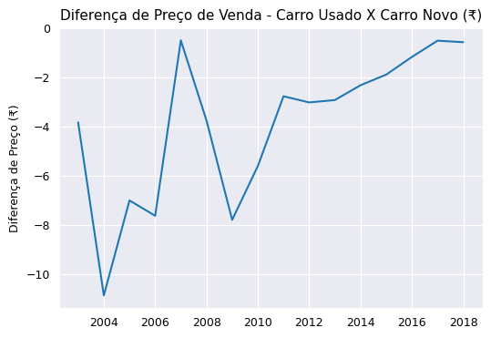

# Previsão de Preço de Carros Usados (Projeto de Regressão)
## Projeto de Machine Learning

Neste projeto de dados, utilizei um conjunto de dados relativo ao preço de venda de vários carros usados na Índia, e com base em tal conjunto de dados, construi um modelo preditivo de regressão linear para prever o preço de venda de tais carros usados.

Tal projeto é dividido entre às fases de **(1)** tratamento de dados, **(2)** análise exploratória de dados, **(3)** preparação e treino do modelo de regressão linear e **(4)** avaliação do modelo final.

Após a importação do dataset, verifiquei o formato de linhas e colunas do conjunto de dados:

* 301 linhas
* 9 colunas

Em seguida, visualizei às primeiras cinco linhas da tabela:

|          |Car_Name | Year    | Selling_Price | Present_Price  | Kms_Driven| Fuel_Type   | Seller_Type  | Transmission  |Owner         |
|----------|---------|---------|---------------|----------------|-----------|-------------|--------------|---------------|--------------|
| 0        | ritz    | 2014    | 3.35          | 5.59           | 27000     | Petrol      | Dealer       | Manual        | 0            |
| 1        | sx4     | 2013    | 4.75          | 9.54           | 43000     | Diesel      | Dealer       | Manual        | 0            |
| 2        | ciaz    | 2017    | 7.25          | 9.85           | 6900      | Petrol      | Dealer       | Manual        | 0            |
| 3        | wagon r | 2011    | 2.85          | 4.15           | 5200      | Petrol      | Dealer       | Manual        | 0            |
| 4        | swift   | 2014    | 4.60          | 6.87           | 42450     | Diesel      | Dealer       | Manual        | 0            |

## Tratamento de dados:

Na fase de tratamento de dados, realizei:

* **Reformatação textual do nome das colunas:**

Construi um list-compreehension para converter todos os nomes das colunas do dataset em letras minúsculas, desse modo, quando fosse me referir ao nome das colunas, não teria que escrever com letra maiúscula a primeira letra de cada coluna:

```
# Formatação textual do nome das colunas, para que todas colunas estejam em minúsculo:

df.columns = [x.lower() for x in df.columns]
```
Saída com o nome das colunas transformado:

```
Index(['car_name', 'year', 'selling_price', 'present_price', 'kms_driven',
       'fuel_type', 'seller_type', 'transmission', 'owner'],
      dtype='object') 
 ```
* **Tratamento de dados nulos:**

Usei o método .isnull().sum() para verificar a quantidade de dados nulos em cada coluna no conjunto de dados e obtive:

```
car_name         0
year             0
selling_price    0
present_price    0
kms_driven       0
fuel_type        0
seller_type      0
transmission     0
owner            0
dtype: int64
```

Ou seja, não havia nenhum dado ausente registrado no conjunto de dados.

Após concluir os principais passos da limpeza de dados, decidi começar o processo de análise exploratória dos dados, para extrair informações e insights importantes sobre o conjunto de dados em questão:

## Análise Exploratória De Dados (EDA):

Antes de inicializar a etapa de análise exploratória, é imprescindível ter um dicionário de dados que explique rapidamente o quê cada coluna informa no conjunto de dados que será analisado:

#### Dicionário de Dados

* **name** - Nome do carro
* **year** - Ano de compra do carro
* **selling_price** - Preço de venda do carro
* **present_price** - Preço atual do carro na concessionária
* **kms_driven** - Distância em kilomêtros percorrida pelo carro
* **fuel_type** - Tipo de combustível do carro
* **seller_type** - Tipo de vendedor (indivíduo ou distribuidora)
* **transmission** - Se o carro é manual ou automático
* **owner** - Quantidade de donos que tal carro já teve anteriormente

Com um dicionário de dados disponível, fiz uma análise exploratória com o objetivo de analisar a relação entre às variáveis preditoras com à variável-alvo **(selling_price)**:

#### (1) Há correlação entre o preço de venda dos carros usados em relação ao ano que foram comprados?

Basicamente, há uma correlação fracamente positiva entre o preço de venda dos carros usados em relação ao ano de compra de tais carros, tal correlação entre tais variáveis é 0.24.

Abaixo, no gráfico de dispersão é possível ver sutilmente que na medida que o ano de compra do carro é mais recente, maior tende à ser o preço de venda de tal carro usado:


Como é observável acima, tal gráfico indica o principal insight de que **quão mais novo é o carro, maior tenderá à ser sua preservação de valor, e logo maior tenderá à ser seu preço de venda em relação à carros antigos (comprados há muito tempo) que tendem à ser mais desvalorizados e terem um preço de venda mais baixo**.

Após obter essa primeira informação, decidi explorar depois essa questão mais à fundo para saber se tal relação entre o preço de venda dos carros usados e o ano de compra de tais carros se confirma:

#### (3) Qual é o preço médio de venda dos carros em relação ao ano de compra de tais carros?

Em média, o preço médio de venda dos carros é 3.711 Lakh, que na **moeda indiana significa que em média o preço médio de venda dos carros usados é de aproximadamente 371 mil rúpias (₹)**

#### (3) Qual é o preço médio de venda dos carros em relação ao ano de compra de tais carros?

Abaixo, plotei um gráfico de colunas para mostrar o preço médio de venda dos carros usados em relação ao ano de compra de tais carros:


Como é visível, de 2008 em diante houve um aumento significativo no preço médio de venda dos carros usados comprados nestes anos (2008-2018) em relação aos anos anteriores à 2008 (2003-2007), ou seja, tal gráfico traz mais confirmações de que **geralmente o preço de venda de carros usados comprados recentemente tende à ser mais caro do que carros comprados há muitos anos atrás**.

#### (4) Qual é a diferença média de preço de venda dos carros usados em relação aos mesmos carros novos na concessionária?

Basicamente, a diferença média de preço de venda de carros usados em relação aos mesmos carros novos na concessionária é de aproximadamente -2.413 Lakh, ou seja, **o preço de venda de carros usados tendem em média à se desvalorizarem e terem uma queda de preço em torno de 241 mil rúpias (₹) em relação ao preço dos mesmos carros novos na concessionária**.

#### (5) Tal diferença de preço entre o preço de venda do carro usado e o preço do carro novo na concessionária aumenta ou diminui em dependência do ano de compra do carro?

Para responder tal pergunta, plotei um gráfico de linha que mostra a tendência de queda ou desvalorização no preço de carros usados em relação à tais carros novos na concessionária:



No gráfico acima, somente carros de 2007 que não se desvalorizam tanto em comparação aos preços atuais de tais carros na concessionária, porém **carros de 2003 até 2010 tiveram uma desvalorização significativa de preço em relação aos seus preços atuais na concessionária, já carros comprados posteriormente à 2011 tiveram uma menor desvalorização em relação aos seus preço atuais de concessionária**.

#### (6) Qual é a distribuição estatística do preço de venda dos carros usados?

Tal questão é importante de ser respondida para sabermos se na variável-alvo há outliers que possam dificultar o aprendizado de máquina do modelo de regressão linear.

Abaixo, há um gráfico de distribuição do preço de venda dos carros usados:


Como é observável, a **distribuição do preço de venda dos carros usados é uma distribuição assimétrica à direita, isto significa que a maioria dos carros usados tem um preço inferior ao preço médio de venda (341 mil rúpias (₹)) e isto indica que há outliers em tal variável, ou seja, há vários carros usados que são vendidos à preços astronômicos de 1 milhão de rúpias para cima em comparação ao preço de venda dos demais carros usados**

Tal informação extraída é útil, para que na fase de pré-processamento, tal variável-alvo seja tratada para que tais outliers não afetem prejudicialmente o treinamento e a acurácia preditiva do modelo de regressão linear

Para termos informações mais acuradas sobre a distribuição do preço de venda dos carros usados, decidi retirar os outliers para termos uma visão mais acurada sobre o intervalo do preço de venda mais frequente dos carros usados:


Notavelmente, **a maioria dos carros tem um preço de venda em torno de 100 mil rúpias (1 Lakh (₹)), isto é, a maioria dos carros usados apresentam um preço de venda abaixo da média de preço, que é 341 mil rúpias (3.41 Lakh (₹))**.

#### (7) Qual é a distribuição estatística do preço presente dos carros novos em relação ao preço de venda dos carros usados?

Em média, o preço de venda presente de tais carros na concessionária é em torno de 630 mil rúpias (6.30 Lakh (₹)), ou seja, uma diferença de 289 mil rúpias (2.89 Lakh (₹)) em relação ao preço de venda dos carros usados 

Graficamente, a distribuição do preço de venda de carros usados junto ao preço de venda de carros novos na concessionária é exposto abaixo:


Como é visto acima, **a distribuição de preço de venda tanto de carros novos quanto dos carros usados é uma distribuição assimétrica à direita, porém ao mesmo tempo é observado que o preço de venda de carros é sutilmente mais caro em relação ao preço de venda dos carros usados**.

#### (8) Há variação de preço de venda dos carros usados com base no tipo de combustível de tais carros?

Basicamente, 70 % dos carros usados no conjunto de dados são carros que são abastecidos com gasolina, enquanto 30 % são carros usados que são abastecidos à Diesel.

Entretanto, há uma diferença notável no preço médio de venda de carros usados abastecidos com gasolina em relação aos que são abastecidos à Diesel:


Visivelmente, é extraído como informação que **o preço médio de venda de carros usados abastecidos à Diesel é mais caro em comparação à de carros abastecidos com gasolina, enquanto o preço médio de venda de carros usados abastecidos à Diesel é em torno de 693 mil rúpias (6.93 Lakh (₹)), o de carros abastecidos com gasolina é em torno de 300 mil rúpias (3.09 Lakh (₹))**.

#### (10) O preço de venda dos carros usados variam se o vendedor for individual ou uma distribuidora?

Há 195 distribuidoras e 106 indivíduos que vendem os carros usados disponíveis em tal dataset, e em média o preço de venda dos carros usados por cada tipo de vendedor é exposto no gráfico de coluna abaixo:


Em suma, **o preço médio de venda de carros usados ofertados por distribuidoras é em torno de 546 mil rúpias (5.46 Lakh (₹)), enquanto o de vendedores individuais é em torno de 72 mil rúpias (0.72 Lakh (₹)), ou seja, notavelmente dependendo do tipo de vendedor do carro, preço de venda final do carro usado será mais caro ou não**.

